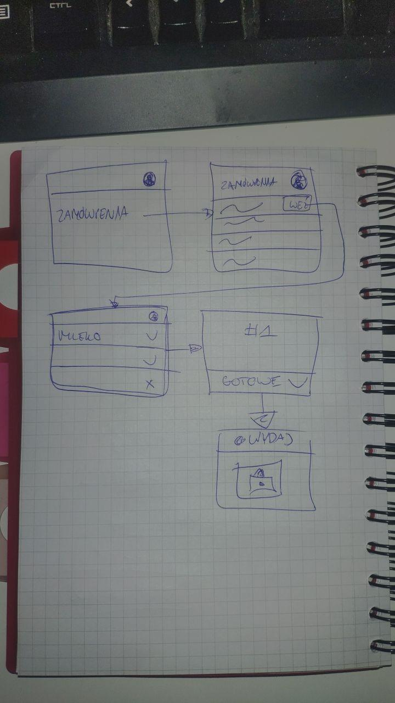

# aplikacja dla sprzedawców

> pozwala na zbieranie zakupów po sklepie i skanowanie QR kodu kogoś kto
> przychodzi odebrać. w React Native dla @pafry7

- trzeba przygotować ReactNative'ową apkę
- trzeba przygotować kilka widoków na bazie makiety - jak cos dopytuj

